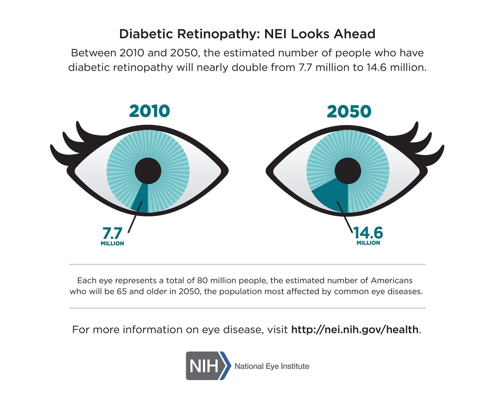

# Mild Diabetic Retinopathy Detection

Diabetic retinopathy is a serious complication of diabetes that affects the blood vessels in the retina, leading to vision problems and potentially blindness if left untreated. It is one of the leading causes of blindness in adults worldwide. The condition develops slowly over time, often without noticeable symptoms in its early stages, making it critical for individuals with diabetes to undergo regular eye exams. Early detection is key to preventing severe vision loss, but the manual screening process can be time-consuming and prone to human error. 

Having an automated tool that can accurately detect retinopathy in its early stages would significantly improve screening efficiency, ensure consistent diagnosis, and allow for timely intervention. Such tools can help identify individuals at risk before symptoms appear, making early treatment more accessible and effective in preserving vision and improving long-term outcomes. This is a first step towards a tool that can detect retinopathy early and accurately.
